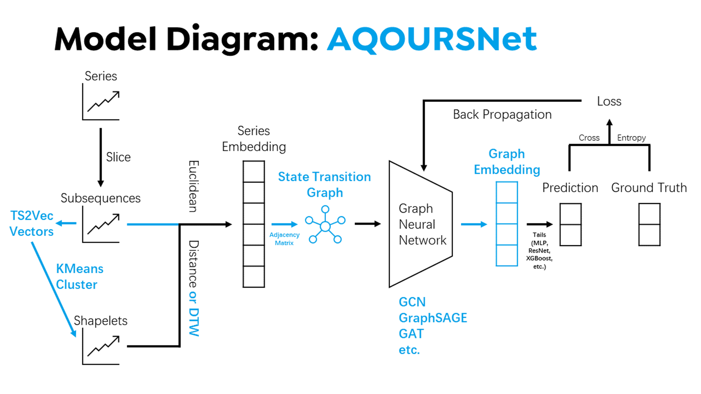

# AQOURSNet: Time2Graph Rework

[Ziyuan Chen](mailto:ziyuan.20@intl.zju.edu.cn), [Zhirong Chen](mailto:zhirong.20@intl.zju.edu.cn) | July 2022  
Summer Research @ [Yang Yang](https://person.zju.edu.cn/yangy) [Lab](http://yangy.org/), Zhejiang University

This work is protected under the [MIT License](https://opensource.org/licenses/MIT).   **Copyright (c) 2022 Ziyuan Chen & Zhirong Chen** unless otherwise noted. 

**IMPORTANT:** This version of demo code works with the attached `ucr_dataset`.  
Refer to the latest [release](https://github.com/AllenHeartcore/AQOURSNet_rsch22su/releases/tag/AQOURSNet) for compatibility support with custom dataset. 

 

**A**utoencoded  
**Q**uantification  
**O**f  
**U**nsupervised  
**R**epresentative  
**S**hapelets  

 

## Running the Program
    $ pip install -r Requirements.txt
    $ python main.py [DATASET] --argument ARGUMENT

Possible arguments are described below. 

<table>
    <tr> <td> <b>Category</b> </td> <td> <b>Argument</b> </td> <td> <b>Description</b> </td> <td> <b>Default</b> </td> </tr>
    <tr> <td rowspan="3"> <b>Dataset</b> </td> <td> <code>Dataset</code> </td> <td> Name of UCR dataset </td> <td> <i>Required</i> </td> </tr>
    <tr> <td> <code>--seed</code> </td> <td> Random seed </td> <td> 42 </td> </tr>
    <tr> <td> <code>--device</code> </td> <td> Device to use </td> <td> <code>cuda</code> if available else <code>cpu<code> </td> </tr>
    <tr> <td rowspan="3"> <b>Shapelets</b> </td> <td> <code>--num-shapelets</code> </td> <td> Number of shapelets to extract </td> <td> 30 </td> </tr>
    <tr> <td> <code>--num-segments</code> </td> <td> Number of segments for mapping </td> <td> 20 </td> </tr>
    <tr> <td> <code>--pruning-percentile</code> </td> <td> Percentile for pruning weak edges </td> <td> 30 </td> </tr>
    <tr> <td rowspan="7"> <b>GAT</b> </td> <td> <code>--hidden-dim</code> </td> <td> Hidden dimension </td> <td> 256 </td> </tr>
    <tr> <td> <code>--embed-dim</code> </td> <td> Embedding dimension of graph (output dimension of GAT) </td> <td> 64 </td> </tr>
    <tr> <td> <code>--num-layers</code> </td> <td> Number of layers </td> <td> 4 </td> </tr>
    <tr> <td> <code>--heads</code> </td> <td> Number of attention heads </td> <td> 8 </td> </tr>
    <tr> <td> <code>--neg-slope</code> </td> <td> Negative slope of <code>LeakyReLU</code> </td> <td> 0.2 </td> </tr>
    <tr> <td> <code>--dropout</code> </td> <td> Dropout rate </td> <td> 0.5 </td> </tr>
    <tr> <td> <code>--tail</code> </td> <td> Type of prediction tail (One of <code>none</code>, <code>linear</code>, <code>mlp</code>, <code>resnet</code>) </td> <td> <code>linear</code> </td> </tr>
    <tr> <td rowspan="4"> <b>Training</b> </td> <td> <code>--epochs</code> </td> <td> Number of epochs </td> <td> 100 </td> </tr>
    <tr> <td> <code>--num-batches</code> </td> <td> Number of mini-batches </td> <td> 16 </td> </tr>
    <tr> <td> <code>--lr</code> </td> <td> Learning rate </td> <td> 0.001 </td> </tr>
    <tr> <td> <code>--weight-decay</code> </td> <td> Weight decay </td> <td> 0.001 </td> </tr>
    <tr> <td rowspan="2"> <b>Enhancements</b> </td> <td> <code>--ts2vec</code> </td> <td> Switch for using TS2VEC* </td> <td> <code>False</code> </td> </tr>
    <tr> <td> <code>--dtw</code> </td> <td> Switch for using DTW </td> <td> <code>False</code> </td> </tr>
</table>

****WARNING:** The condensed `ts2vec.py` (`--ts2vec` option) has **not** been thoroughly tested. Use with caution.   In case it fails, delete `ts2vec.py`, and clone [yuezhihan/ts2vec](https://github.com/yuezhihan/ts2vec) under the same folder.*

## Model Pipeline
0. Data preparation
1. Time series ---extract---> Shapelets
2. Time series & shapelets ---embed---> Series embedding
3. Series embedding ---construct---> Graph
4. Graph ---embed---> Graph embedding
5. Graph embedding ---predict---> Predicted classes

## Folder Structure
- `Stanford_CS224w` - a prerequisite [course](http://web.stanford.edu/class/cs224w/)
    - `*.py` - condensed code for GNNs like [GCN](https://colab.research.google.com/drive/1BRPw3WQjP8ANSFz-4Z1ldtNt9g7zm-bv?usp=sharing), [GraphSAGE](https://colab.research.google.com/drive/1bAvutxJhjMyNsbzlLuQybzn_DXM63CuE), and [GAT](https://colab.research.google.com/drive/1X4uOWv_xkefDu_h-pbJg-fEkMfR7NGz9?usp=sharing), adapted from the course materials
    - `dataset` - datasets required by the demos (raw only)
    - `deepsnap` - auxiliary code from [snap-stanford@GitHub](https://github.com/snap-stanford/deepsnap). **Copyright (c) 2019 DeepSNAP Team**
- `ref_papers` - papers associated with *shapelets* providing essential background knowledge
    - `traditional` - evolution since [2009](https://doi.org/10.1145/1557019.1557122): [Logical](https://doi.org/10.1145/2020408.2020587), [ST](https://doi.org/10.1145/2339530.2339579), [Unsupervised](https://doi.org/10.1109/ICDM.2012.26), [FS](https://doi.org/10.1137/1.9781611972832.74), [LS](https://doi.org/10.1145/2623330.2623613), [Random](https://doi.org/10.48550/arXiv.1503.05018), [Forest](https://doi.org/10.1109/BigData.2014.7004344), [Random forest](https://doi.org/10.1007/s10618-016-0473-y), etc. 
    - `neural_network` - SOTA [DNNs](https://doi.org/10.1109/IJCNN.2017.7966039) like [Dynamic](https://doi.org/10.48550/arXiv.1906.00917), [Adversarial](https://doi.org/10.48550/arXiv.1906.00917), [Adv. Dynamic](https://doi.org/10.1609/AAAI.v34i04.5948), [ShapeNet](https://ojs.aaai.org/index.php/AAAI/article/view/17018), [BSPCover](https://doi.org/10.1109/ICDE51399.2021.00254), etc. ([Review](https://doi.org/10.1007/s10618-019-00619-1))
- `cached_programs` - historical versions and experiments of KMeans, SVM, MLP, ResNet, Time2Vec, hierarchies, etc. 
    - ***WARNING:** Codes in the cache are not optimized for environment compatibility and may not run properly.*
- `affiliated_licenses` - LICENSEs for code segments from [yuezhihan](https://github.com/yuezhihan/ts2vec/blob/main/LICENSE), [subhadarship](https://github.com/subhadarship/kmeans_pytorch/blob/master/LICENSE), [DTW](https://github.com/DynamicTimeWarping/dtw-python/blob/master/LICENSE), and [pyg-team](https://github.com/pyg-team/pytorch_geometric/blob/master/LICENSE). 
- `ucr_dataset` - a neatly formatted version of [the UCR Dataset](https://www.cs.ucr.edu/~eamonn/time_series_data_2018/UCRArchive_2018.zip) in compressed `.npz`
    - The numpy arrays contained in each file have keys `train_data`, `train_label`, `test_data`, `test_label`
    - `*_data` has shape `(num_samples, num_features)`, `*_label` has shape `(num_samples,)`
- `presentation` - presentation materials including slides and diagrams

## Call Hierarchy
- `main.py`
    - `utils.py` (#0: `ucr_dataset`, #3 wrapper: `GraphDataset`)
    - `construct_graph.py` (#1 wrapper: `extract_shapelets`, #2: `embed_series`, #3: `adjacency_matrix`)
        - `ts2vec.py` (#1 optional enhancement: `TS2Vec`)
        - `kmeans.py` (#1: `kmeans`)
        - `dtw` (#2 optional enhancement: `dtw`)
    - `network.py` (#4: `GAT`, #5: `MultilayerPerceptron` & `FCResidualNetwork`)
        - `xgboost` (**TO BE IMPLEMENTED**)

## Credits
- Original Time2Graph model by [Cheng et al., 2020](https://ojs.aaai.org/index.php/AAAI/article/view/5769) & [Cheng et al., 2021](https://ieeexplore.ieee.org/document/9477138), code inspired by [petecheng@GitHub](https://github.com/petecheng/Time2GraphPlus)
- Time2Vec algorithm (essence of AQOURS) by [Kazemi et al., 2019](https://arxiv.org/abs/1907.05321), code adapted from [yuezhihan@GitHub](https://github.com/yuezhihan/ts2vec)
    - **Copyright (c) 2022 Zhihan Yue**
- KMeans acceleration on PyTorch by [subhadarship@GitHub](https://github.com/subhadarship/kmeans_pytorch), with adaptations
    - **Copyright (c) 2020 subhadarshi**
- DTW algorithm implemented by [DynamicTimeWarping@GitHub](https://github.com/DynamicTimeWarping/dtw-python)
    - **Copyright (c) 2019 Toni Giorgino**
- GAT structure by [Veličković et al., 2017](https://arxiv.org/abs/1710.10903), code inspired by [Stanford CS224w](https://colab.research.google.com/drive/1X4uOWv_xkefDu_h-pbJg-fEkMfR7NGz9?usp=sharing), [pyg-team](https://github.com/pyg-team/pytorch_geometric/blob/master/examples/gat.py), [DGraphXinye@GitHub](https://github.com/DGraphXinye/DGraphFin_baseline/blob/master/models/gat.py)
    - **Copyright (c) 2021 Matthias Fey, Jiaxuan You** (pyg-team)
- MLP & ResNet (prediction tail) structures inspired by [Wang et al., 2017](https://ieeexplore.ieee.org/document/7966039)
- Data from [the 
UCR Time Series Classification Archive](https://www.cs.ucr.edu/~eamonn/time_series_data_2018/), as documented in [Dau et al., 2018](https://arxiv.org/abs/1810.07758)
- Python modules: [`torch`](https://pytorch.org/docs/stable/index.html), [`torch_geometric`](https://pytorch-geometric.readthedocs.io/en/latest/), [`kmeans`](https://pypi.org/project/kmeans-pytorch/), [`dtw`](https://dynamictimewarping.github.io/python/), [`xgboost`](https://xgboost.readthedocs.io/en/stable/python/index.html)
